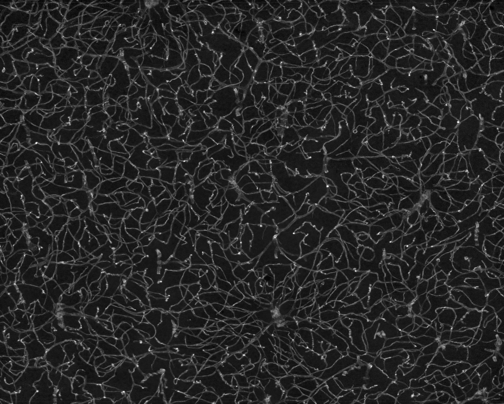
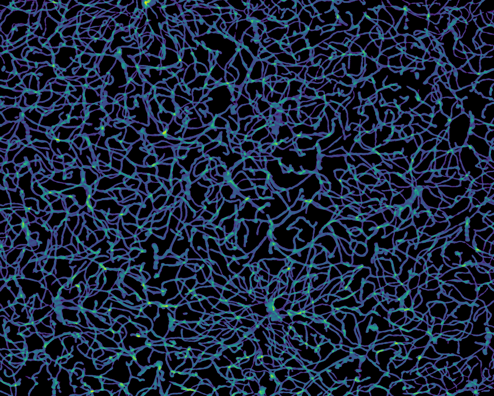
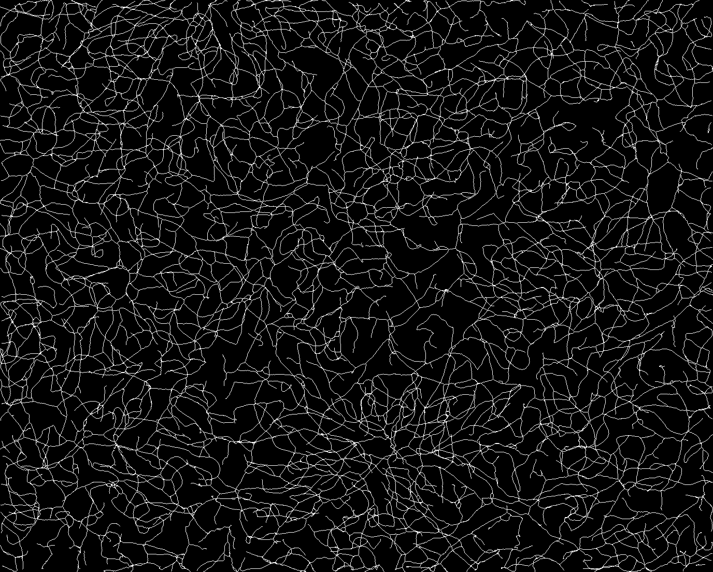
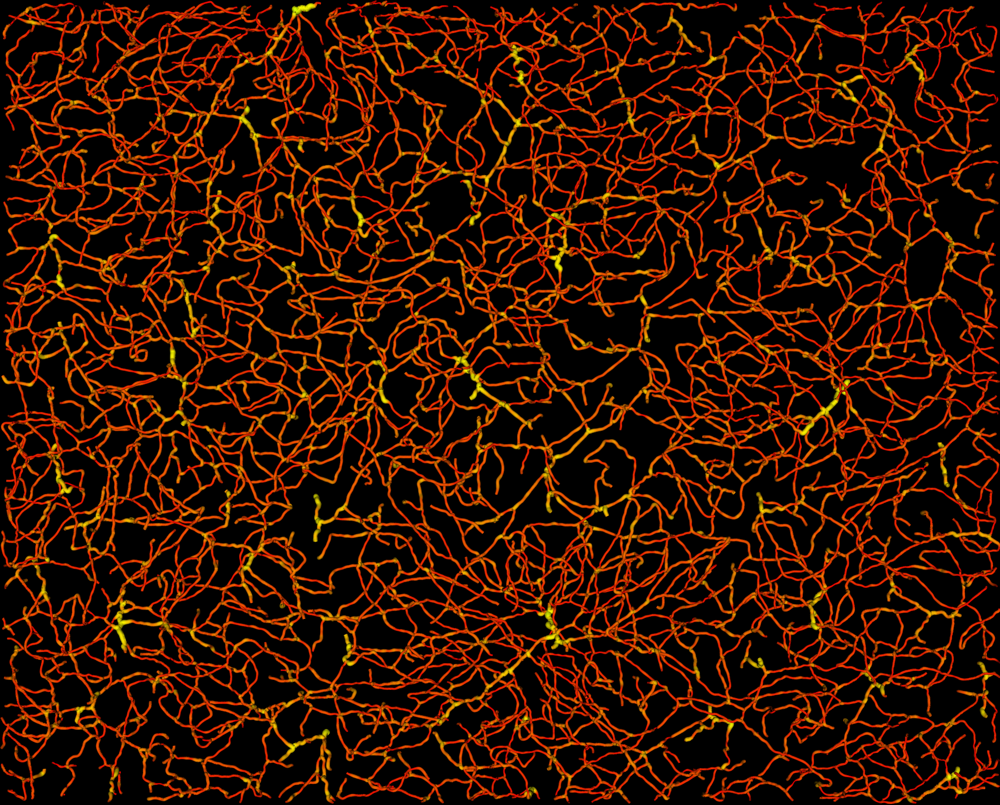
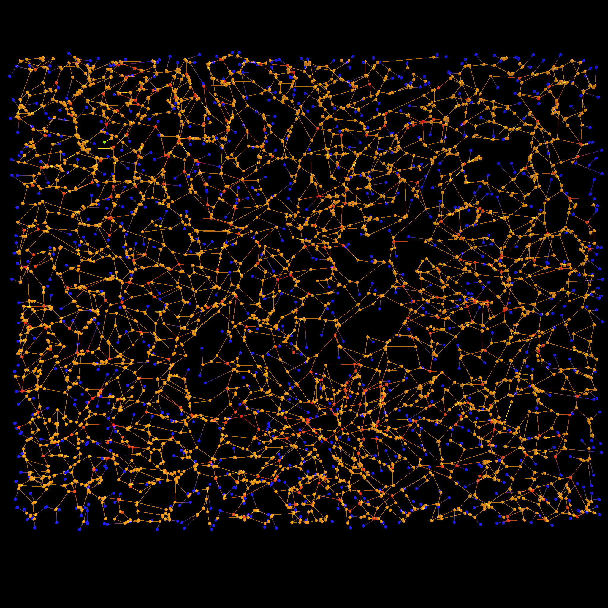

# Python Blood Vessel Topology Analysis

**Py**thon Blood **Ves**sel **To**pology Analysis (PyVesTo) is a framework for analysing blood vessel digital images. This includes the segmentation, representation and characterization of blood vessels. The framework identifies 2D and 3D vascular systems and represent them using graphs. The graphs describe the **topology** of the blood vessels, that is, bifurcations and terminations are represented as nodes and two nodes are connected if there is a blood vessel segment between them.

Functions are provided for measuring blood vessel density, number of bifurcation points and tortuosity, but other metrics can be implemented. The created graphs are objects from the [Networkx](https://networkx.org/) libray.

PyVesTo has been used in the following publications:

* McDonald, Matthew W., Matthew S. Jeffers, Lama Issa, Anthony Carter, Allyson Ripley, Lydia M. Kuhl, Cameron Morse et al. "An Exercise Mimetic Approach to Reduce Poststroke Deconditioning and Enhance Stroke Recovery." **Neurorehabilitation and Neural Repair** 35, no. 6 (2021): 471-485.
* Ouellette, Julie, Xavier Toussay, Cesar H. Comin, Luciano da F. Costa, Mirabelle Ho, María Lacalle-Aurioles, Moises Freitas-Andrade et al. "Vascular contributions to 16p11. 2 deletion autism syndrome modeled in mice." **Nature Neuroscience** 23, no. 9 (2020): 1090-1101.
* Boisvert, Naomi C., Chet E. Holterman, Jean-François Thibodeau, Rania Nasrallah, Eldjonai Kamto, Cesar H. Comin, Luciano da F. Costa et al. "Hyperfiltration in ubiquitin C-terminal hydrolase L1-deleted mice." **Clinical Science** 132, no. 13 (2018): 1453-1470.
* Gouveia, Ayden, Matthew Seegobin, Timal S. Kannangara, Ling He, Fredric Wondisford, Cesar H. Comin, Luciano da F. Costa et al. "The aPKC-CBP pathway regulates post-stroke neurovascular remodeling and functional recovery." **Stem cell reports** 9, no. 6 (2017): 1735-1744.
* Kur, Esther, Jiha Kim, Aleksandra Tata, Cesar H. Comin, Kyle I. Harrington, Luciano da F Costa, Katie Bentley, and Chenghua Gu. "Temporal modulation of collective cell behavior controls vascular network topology." **Elife** 5 (2016): e13212.
* Lacoste, Baptiste, Cesar H. Comin, Ayal Ben-Zvi, Pascal S. Kaeser, Xiaoyin Xu, Luciano da F. Costa, and Chenghua Gu. "Sensory-related neural activity regulates the structure of vascular networks in the cerebral cortex." **Neuron** 83, no. 5 (2014): 1117-1130.

### 3D Blood Vessel Image

The library works for 2D and 3D blood vessel images but the focus of the library lies on 3D confocal microscopy images, such as this one:

### Segmentation

File [segmentation.py](pyvesto/segmentation.py) contains the segmentation routines, aimed at classifying pixels into two categories: blood vessel or background. The image below is a sum projection of a 3D binary image.

### Medial Lines

File [skeleton.py](pyvesto/skeleton.py) contains a skeletonization function implemented in C and interfaced using ctypes for calculating the medial lines of the blood vessels. This function was compiled for Linux.

### Blood Vessel Reconstruction

Having the binary image and the medial lines, a model of the blood vessels surface can be generated:

### Graph Generation and Adjustment

Files inside the [graph](pyvesto/graph.py) folder are responsible for creating the graph and removing some artifacts such as small branches generated from the skeleton calculation.

### Measurements

Functions inside [measure.py](pyvesto/measure.py) implement some basic blood vessel measurmeents.

### Whole Pipeline

The notebook [blood_vessel_pipeline.ipynb](notebooks/blood_vessel_pipeline.ipynb) contains an example pipeline for applying all the functionalities. 

### Dependencies (version)
* Python (3.7.4)
* scipy (1.4.1)
* numpy (1.19.2)
* networkx (2.4)
* matplotlib (3.3.4)
* igraph (0.7.1) - optional

**Warning, the skeletonization functions only work on Linux.**