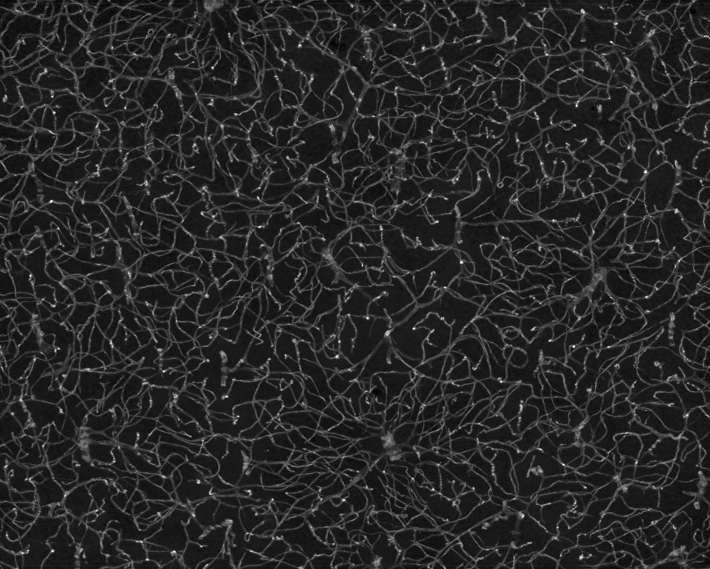
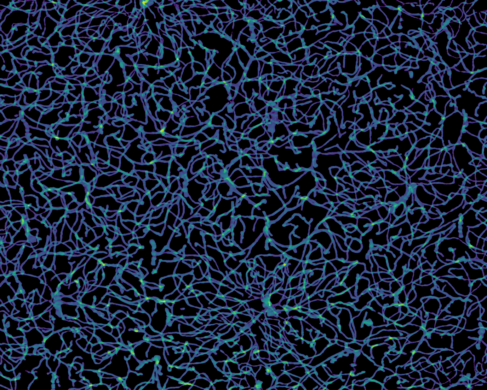
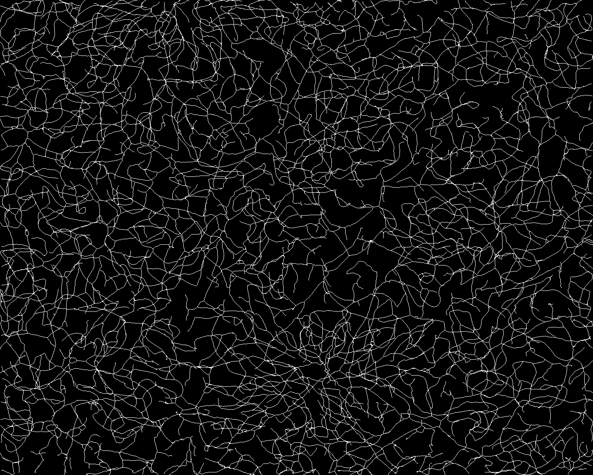
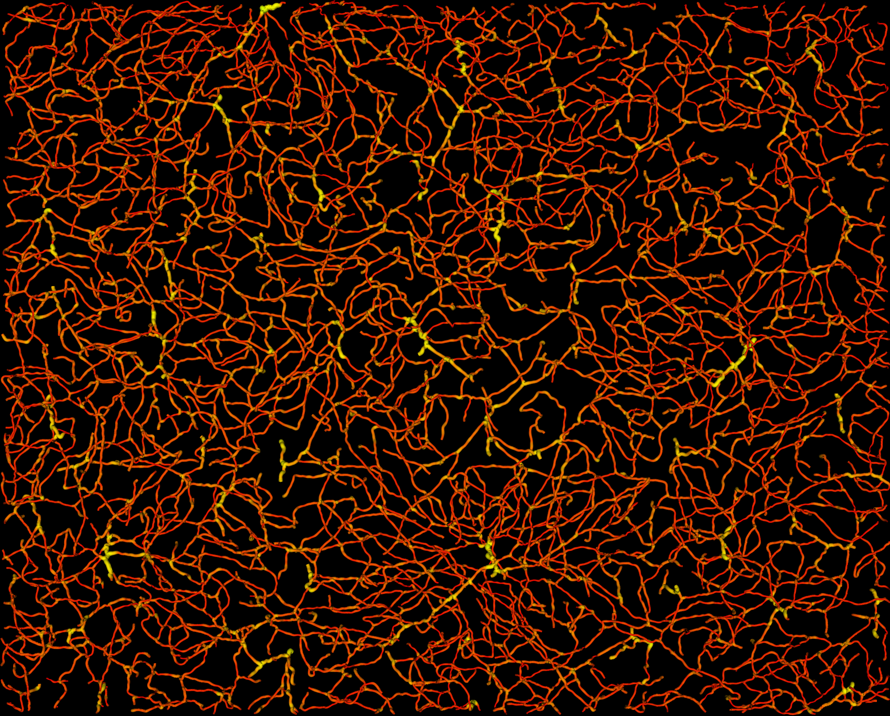
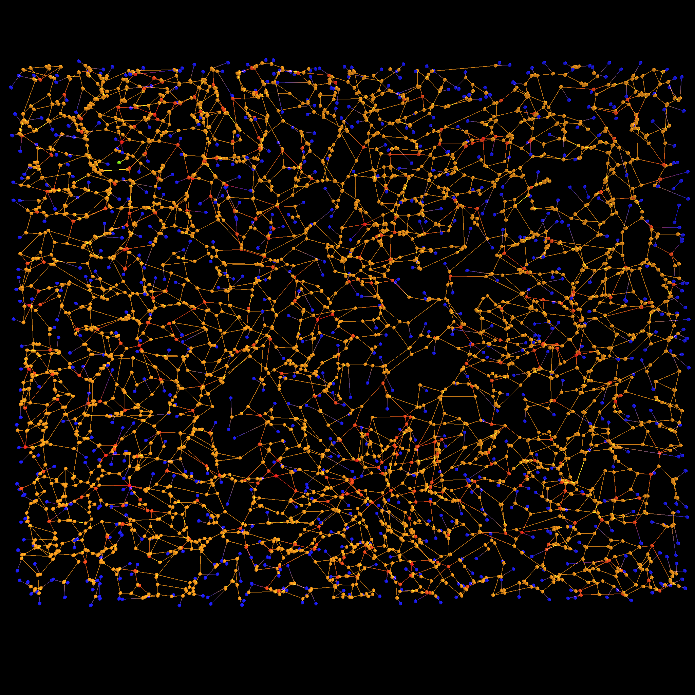

# Python Vascular Network Analysis

**Py**thon  **Va**scular **Ne**twork Analysis (PyVaNe) is a framework for analysing blood vessel digital images. This includes the segmentation, representation and characterization of blood vessels. The framework identifies 2D and 3D vascular systems and represent them using graphs. The graphs describe the **topology** of the blood vessels, that is, bifurcations and terminations are represented as nodes and two nodes are connected if there is a blood vessel segment between them.

Functions are provided for measuring blood vessel density, number of bifurcation points and tortuosity, but other metrics can be implemented. The created graphs are objects from the [Networkx](https://networkx.org/) libray.

🔴 **PyVaNe is undergoing significant changes! A new graph creation methodology has been implemented and neural network segmentation will be added soon. See the [graph creation](examples/Graph%20creation.ipynb) example for an overview of the graph functionalities.**

**The pipeline functionality has been temporarily removed. Please use the individual functions instead.**

### 3D Blood Vessel Image

The library works for 2D and 3D blood vessel images but the focus of the library lies on 3D confocal microscopy images, such as this one:

### Segmentation

Folder [segmentation](pyvane/segmentation) contains the segmentation routines, aimed at classifying pixels into two categories: blood vessel or background. The image below is a sum projection of a 3D binary image.

### Medial Lines

Folder [skeletonization](pyvane/skeletonization) contains a skeletonization function implemented in C and interfaced using ctypes for calculating the medial lines of the blood vessels. This function was compiled for Linux.

### Blood Vessel Reconstruction

Having the binary image and the medial lines, a model of the blood vessels surface can be generated:

### Graph Generation and Adjustment

Folder [graph](pyvane/graph) contains a robust procedure for creating the graph and removing some artifacts such as small branches generated from the skeleton.

### Measurements

Functions inside [metrics](pyvane/metrics) implement some basic blood vessel measurmeents.

### Dependencies (version)
* Python (3.13)
* scipy (1.13.0)
* numpy (1.26.4)
* networkx (3.3)
* matplotlib (3.8.4)
* natsort (8.4.0)
* scikit-image (0.22.0)
* python-igraph (0.11.4) - optional

**Warning, the Palágyi-Kuba skeletonization function only work on Linux.**

PyVaNe has been used in the following publications:

* Ouellette, J., Warsi, S., Romero, P., Khare, P., Naz, S., Aubert-Tandon, L., Pileggi, C., Yandiev, S., Freitas-Andrade, M., Comin, C.H. and Harper, M.E., 2025. Purinergic receptor activation rectifies autism-associated endothelial dysfunction. **Journal of Cerebral Blood Flow and Metabolism**, p. 262-262.
* Freitas-Andrade, M., Comin, C.H., Van Dyken, P., Ouellette, J., Raman-Nair, J., Blakeley, N., Liu, Q.Y., Leclerc, S., Pan, Y., Liu, Z. and Carrier, M., 2023. Astroglial Hmgb1 regulates postnatal astrocyte morphogenesis and cerebrovascular maturation. **Nature Communications**, 14(1), p.4965.
* Lithopoulos, M.A., Toussay, X., Zhong, S., Xu, L., Mustafa, S.B., Ouellette, J., Freitas-Andrade, M., Comin, C.H., Bassam, H.A., Baker, A.N. and Sun, Y., 2022. Neonatal hyperoxia in mice triggers long-term cognitive deficits via impairments in cerebrovascular function and neurogenesis. **The Journal of Clinical Investigation**, 132(22).
* Freitas-Andrade, M., Comin, C.H., da Silva, M.V., Costa, L.D.F. and Lacoste, B., 2022. Unbiased analysis of mouse brain endothelial networks from two-or three-dimensional fluorescence images. **Neurophotonics**, 9(3), pp.031916-031916.
* Bordeleau, M., Comin, C.H., Fernández de Cossío, L., Lacabanne, C., Freitas-Andrade, M., González Ibáñez, F., Raman-Nair, J., Wakem, M., Chakravarty, M., Costa, L.D.F. and Lacoste, B., 2022. Maternal high-fat diet in mice induces cerebrovascular, microglial and long-term behavioural alterations in offspring. **Communications Biology**, 5(1), p.26.
* McDonald, Matthew W., Matthew S. Jeffers, Lama Issa, Anthony Carter, Allyson Ripley, Lydia M. Kuhl, Cameron Morse et al. "An Exercise Mimetic Approach to Reduce Poststroke Deconditioning and Enhance Stroke Recovery." **Neurorehabilitation and Neural Repair** 35, no. 6 (2021): 471-485.
* Ouellette, Julie, Xavier Toussay, Cesar H. Comin, Luciano da F. Costa, Mirabelle Ho, María Lacalle-Aurioles, Moises Freitas-Andrade et al. "Vascular contributions to 16p11. 2 deletion autism syndrome modeled in mice." **Nature Neuroscience** 23, no. 9 (2020): 1090-1101.
* Boisvert, Naomi C., Chet E. Holterman, Jean-François Thibodeau, Rania Nasrallah, Eldjonai Kamto, Cesar H. Comin, Luciano da F. Costa et al. "Hyperfiltration in ubiquitin C-terminal hydrolase L1-deleted mice." **Clinical Science** 132, no. 13 (2018): 1453-1470.
* Gouveia, Ayden, Matthew Seegobin, Timal S. Kannangara, Ling He, Fredric Wondisford, Cesar H. Comin, Luciano da F. Costa et al. "The aPKC-CBP pathway regulates post-stroke neurovascular remodeling and functional recovery." **Stem cell reports** 9, no. 6 (2017): 1735-1744.
* Kur, Esther, Jiha Kim, Aleksandra Tata, Cesar H. Comin, Kyle I. Harrington, Luciano da F Costa, Katie Bentley, and Chenghua Gu. "Temporal modulation of collective cell behavior controls vascular network topology." **Elife** 5 (2016): e13212.
* Lacoste, Baptiste, Cesar H. Comin, Ayal Ben-Zvi, Pascal S. Kaeser, Xiaoyin Xu, Luciano da F. Costa, and Chenghua Gu. "Sensory-related neural activity regulates the structure of vascular networks in the cerebral cortex." **Neuron** 83, no. 5 (2014): 1117-1130.